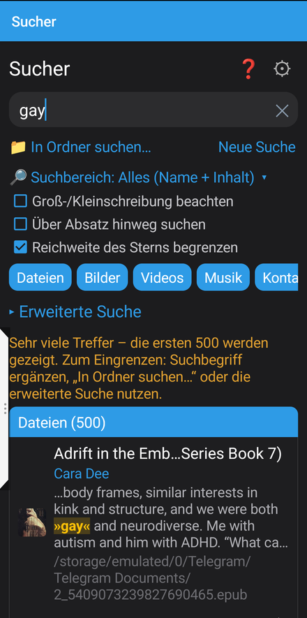
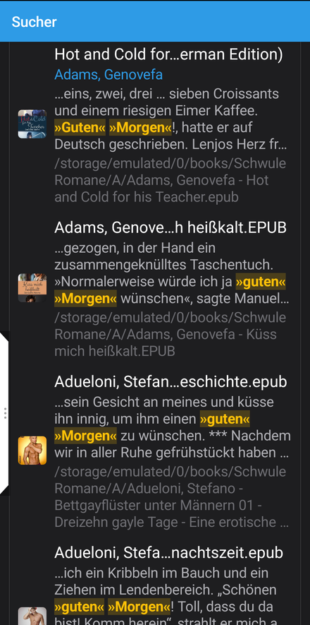
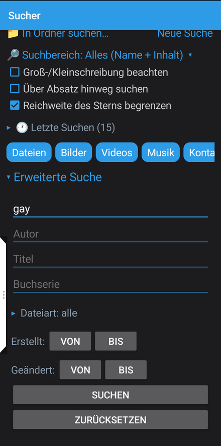
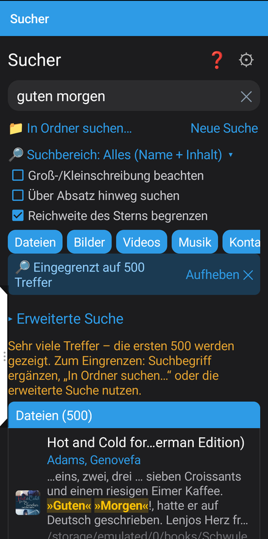

> 🇬🇧 **English:** [README.md](README.md) · 🇩🇪 **Deutsch:** README.de.md *(diese Seite)*

# Sucher

Eine eigenständige Android-Gerätesuche: Volltextsuche über Dateien
(TXT/MD, Office DOCX/XLSX/PPTX und die alten Formate DOC/XLS/PPT,
OpenDocument ODT/ODS/ODP, PDF, EPUB/FB2, MOBI/AZW3 und optional den Inhalt
von ZIP/7z/TAR-Archiven), dazu Kontakte, Kalendertermine, SMS, das
Anrufprotokoll **und mitgeschnittene System-Benachrichtigungen** — alles in
einem Suchfeld.

**Benachrichtigungen mitschneiden & durchsuchen (pro App, freiwillig).** Sucher
kann eingehende System-Benachrichtigungen aufzeichnen und **verlustfrei
durchsuchbar halten — auch nachdem Du sie weggewischt hast**. Damit findest Du
auch Tage später noch eine Paket-Sendungsnummer, einen 2FA-/Bestätigungscode,
eine Bestellbestätigung oder jede andere kurze Nachricht, die sonst weg wäre. Du
entscheidest **pro App**, wessen Benachrichtigungen mitgeschnitten werden; der
volle Text (nicht nur die eine Zeile) wird gespeichert, sodass jedes Feld
durchsuchbar bleibt und später ausgewertet werden kann. Bereits mitgeschnittene
Benachrichtigungen bleiben durchsuchbar, selbst wenn Du den
Benachrichtigungszugriff wieder entziehst, und lassen sich jederzeit löschen.
(Freiwillig, über Androids Benachrichtigungszugriff.)

Am 2026-09-24 aus [EdgeTab](../../EdgeTab/) herausgelöst, wo es als Tab begann,
bevor sich zeigte, dass es eine eigene App verdient (anderes Berechtigungsprofil,
anderes Nutzungsmuster — direkt öffnen, suchen, fertig, kein dauerhaft laufender
Hintergrunddienst).

Suchergebnisse lassen sich weiter eingrenzen: nach jeder Suche schränkt
„🔎 Nur in diesen N Treffern weitersuchen" jede folgende Suche — einfach oder
erweitert, mit völlig anderen Begriffen oder Feldern — auf genau diese
Treffermenge ein, bis sie wieder aufgehoben wird. Wiederholbar, sodass eine
breite erste Suche Schritt für Schritt eingegrenzt werden kann, statt eine
einzige riesige Kombi-Suchanfrage zu bauen.

## Voraussetzungen

- Läuft ab **Android 10** aufwärts (Mindest-SDK 29), Ziel-SDK 34 (Android 14).

## Screenshots

<table>
<tr>
<td><br>Suche</td>
<td><br>Volltext-Treffer</td>
<td><br>Erweiterte Suche</td>
</tr>
<tr>
<td><br>Ergebnisse eingrenzen</td>
</tr>
</table>

## Unterstützte Formate

| Format | Verfahren | Hinweise |
|---|---|---|
| Reiner Text: TXT, MD/Markdown, CSV, LOG, JSON, XML, SRT, INI, YAML/YML | direktes Lesen | |
| DOCX/XLSX/PPTX | ZIP+XML über Androids eingebauten `XmlPullParser` | kein Apache POI nötig |
| OpenDocument ODT/ODS/ODP/ODG/ODF + Vorlagen OTT/OTS/OTP | dasselbe (meta.xml + content.xml) | LibreOffice/OpenOffice |
| EPUB/FB2 | dasselbe | |
| PDF | PDFBox-Android | verschlüsselte PDFs: nur Dateiname, nicht entschlüsselt |
| DOC/XLS/PPT (alt) | Apache POI (nur `poi`+`poi-scratchpad`, kein `poi-ooxml`) | |
| MOBI/AZW3/AZW/PRC | eigener PalmDOC/MOBI6-Leser | HUFF/CDIC-komprimierte Bücher: nur Dateiname; DRM-Bücher: nur Dateiname, bewusst so |
| CBZ | Dateiname + `ComicInfo.xml`-Metadaten, falls vorhanden | |
| CBR | nur Dateiname | kein RAR-Leser eingebunden, nur für Metadaten nicht lohnend |
| ZIP/7z/TAR(.gz/.bz2/.xz), einzelne .gz/.bz2/.xz | Inhalt indiziert (jedes innere Dokument extrahiert) | optional, standardmäßig aus („Archive durchsuchen"); RAR nur Dateiname (kein freier, GPL-kompatibler Entpacker) |

Jede Datei bekommt unabhängig vom Format eine Metadaten-Zeile, sodass die
Suche nach Name/Typ/Datum alles abdeckt, nicht nur die Tabelle oben.

Neben Dateien durchsucht Sucher auch **Kontakte, Kalendertermine, SMS und das
Anrufprotokoll** (je eine eigene Ergebniskategorie, live abgefragt — nichts
gespeichert) sowie **mitgeschnittene Benachrichtigungen** (freiwillig über den
Benachrichtigungszugriff, **pro App aktivierbar**; bereits mitgeschnittene
bleiben durchsuchbar, auch nachdem die Berechtigung entzogen wurde, und lassen
sich unter „Berechtigungen" löschen). Jede mitgeschnittene Benachrichtigung
wird **verlustfrei** gespeichert — jedes Feld, das sie enthielt, über
`Notifications.toJson` der gemeinsamen Bibliothek, nicht nur Titel und eine
Zeile —, sodass der volle Text durchsuchbar ist und jedes Feld später
ausgewertet werden kann. SMS und Anrufprotokoll brauchen eigene
Berechtigungen, die bei Bedarf erteilt werden.

## Bauen

Kein Gradle — derselbe rohe Android-SDK-Kommandozeilen-Build wie EdgeTab. Du
brauchst:

- Android SDK (`platforms;android-34`, `build-tools;34.0.0`, `platform-tools`)
- ein JDK (11+)
- einen Signier-Keystore (dieses Projekt nutzt den von EdgeTab mit — wie man
  einen erzeugt, steht in dessen README)

```sh
SDK=/pfad/zum/android/sdk
BT="$SDK/build-tools/34.0.0"
AJAR="$SDK/platforms/android-34/android.jar"
KEYSTORE=/pfad/zum/keystore.p12

rm -rf build && mkdir -p build/gen build/obj
"$BT/aapt2" compile --dir res -o build/res.zip
# -A assets ist nötig: PDFBox-Androids PDFBoxResourceLoader liest seine
# Font-/Glyph-Daten zur Laufzeit aus assets/com/tom_roush/..., und der
# In-App-Changelog (assets/CHANGELOG.md) wird genauso geladen. Frühere Builds
# ließen dieses Flag versehentlich weg - PDF-Darstellung lief trotzdem
# (in try/catch gekapselt), aber still ohne korrekte Font-Metriken.
"$BT/aapt2" link -o build/base.apk -I "$AJAR" --manifest AndroidManifest.xml \
  --java build/gen -R build/res.zip -A assets --auto-add-overlay \
  --min-sdk-version 29 --target-sdk-version 34
# Gemeinsame Klassen liegen in den Git-Submodulen common/ (Diagnose, Einstellungs-
# Sicherung, Benachrichtigungs-Kern u. a.) und docextract/ (Format-Extraktoren) -
# vor dem Bauen einmal `git submodule update --init` ausführen; beide src/ werden
# mitkompiliert.
javac --release 11 -d build/obj -classpath "$AJAR:$(echo libs/*.jar | tr ' ' ':')" \
  $(find src build/gen common/src docextract/src -name '*.java' 2>/dev/null)
# module-info.class (JPMS) und META-INF/versions/ (Multi-Release-JAR-Klassen,
# z. B. bringt log4j-api eine Java-9-Variante von Base64Util mit) verwirren d8
# beide, wenn sie drinbleiben - Ersteres ist keine echte Klasse, Letzteres
# verursacht „defined multiple times"-Duplikatfehler, da d8 beide Varianten
# unversioniert sieht.
(cd build/obj && for j in ../../libs/*.jar; do jar xf "$j"; done && find . -name 'module-info.class' -delete && rm -rf META-INF/versions)
"$BT/d8" --min-api 29 --lib "$AJAR" --output build/ $(find build/obj -name '*.class')
cp build/base.apk build/unsigned.apk
(cd build && zip -qj unsigned.apk classes*.dex)
"$BT/zipalign" -f -p 4 build/unsigned.apk build/aligned.apk
"$BT/apksigner" sign --ks "$KEYSTORE" --ks-type PKCS12 --out build/Sucher.apk build/aligned.apk
```

## Warum es das gibt

Ein Begleiter zu EdgeTab aus demselben Grund, aus dem EdgeTab existiert: die
übliche Android-Suche greift nicht in Dateiinhalte, und keine einzelne freie
App deckt Office+PDF+E-Book+Comic-Metadaten-Suche ab, ohne zu einem 19-MB-,
werbefinanzierten Paket zu werden. Freie/quelloffene Grundlagenarbeit,
derselbe Autor.

## Dokumentation

- **Deutsch:** [Anleitung](docs/Sucher-Anleitung.pdf) · [Werbung](docs/Sucher-Werbung.pdf)
- **English:** [User guide](docs/Sucher-Guide.pdf) · [Flyer](docs/Sucher-Flyer.pdf)

## Lizenz

GNU General Public License v3.0 (oder später) — siehe `LICENSE`. Die
eingebundenen Fremdbibliotheken (Apache POI, PdfBox-Android, Apache Commons,
Log4j API, SparseBitSet, curvesapi) bleiben unter ihren eigenen permissiven
Lizenzen (Apache 2.0 / BSD-3-Clause), beide mit GPLv3 kompatibel — Versionen,
Links und die erforderlichen Hinweise stehen in
[THIRD-PARTY-NOTICES.md](THIRD-PARTY-NOTICES.md).
